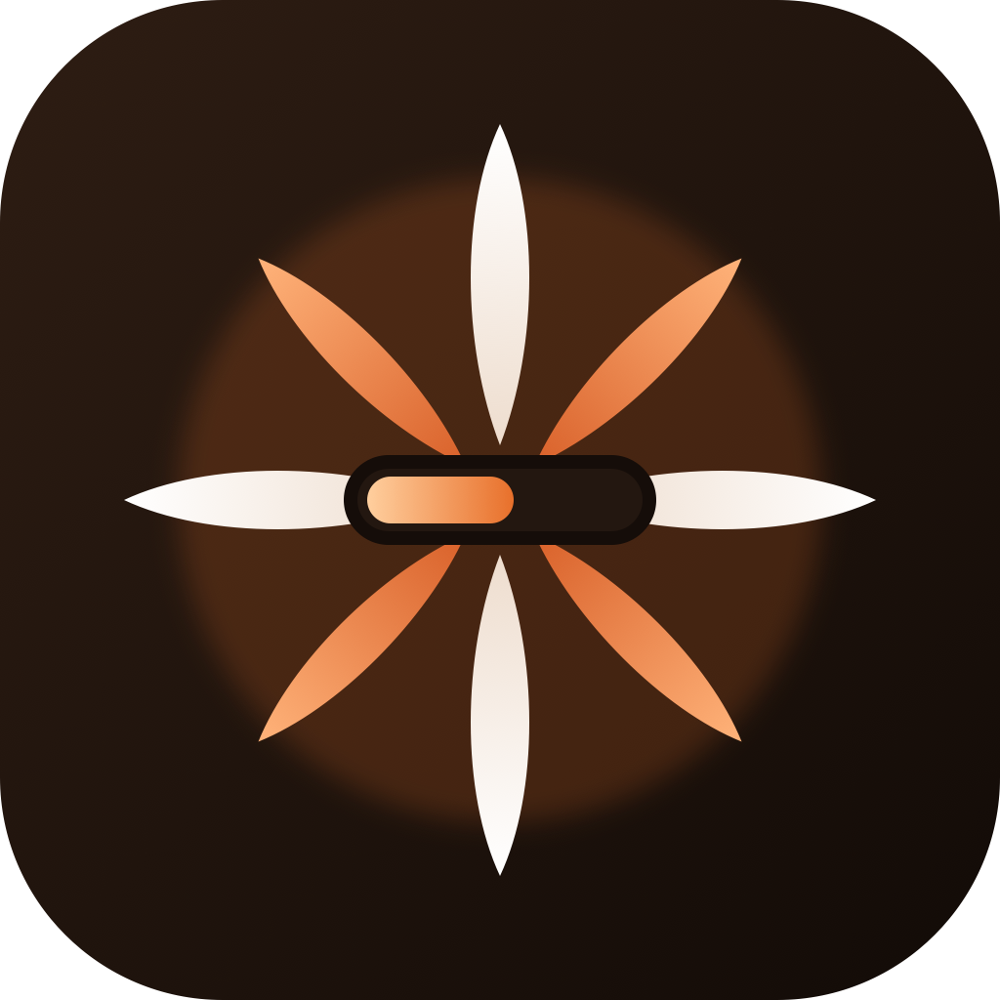
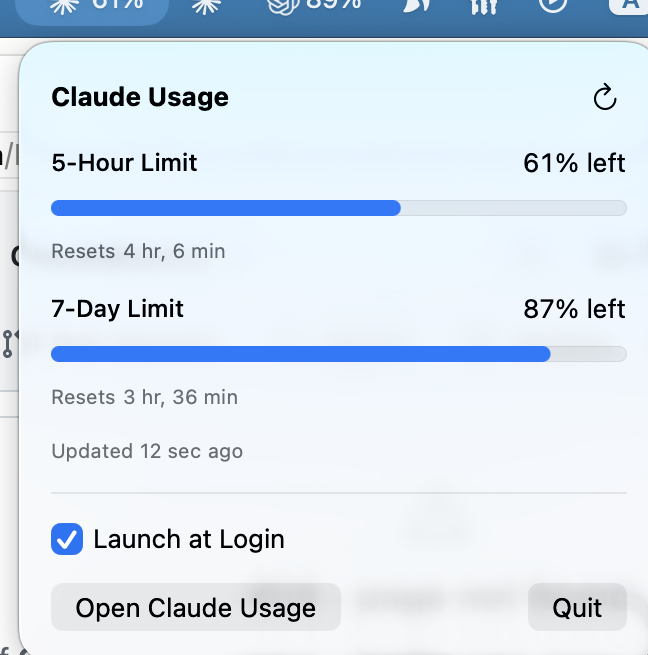

<p align="center">
  
</p>

<h1 align="center">Claude Usage Menubar</h1>

<p align="center">
  A macOS menu bar utility that shows your Claude usage limits in real time — no tab-switching, no surprise "limit reached" mid-session.
</p>

<p align="center">
  
  
  
</p>

---

## Screenshot

<p align="center">
  
</p>

*The dropdown panel, live from a real dev machine — 5-hour and 7-day usage with reset countdowns.*

## Features

- **5-hour limit**: percentage used in the current window, with a reset countdown
- **7-day limit**: percentage used in the current window, with a reset countdown
- **Launch at Login**: optional toggle, backed by `SMAppService`
- **Live data**: polls Anthropic's usage API every 5 minutes, with a manual refresh (⌘R)
- Lives entirely in the menu bar — no dock icon, no browser tab

## How it works

Claude Usage Menubar polls Anthropic's usage API directly, using the OAuth token Claude Code already stored on your machine (from its keychain entry, or `~/.claude/.credentials.json` as a fallback) — no separate sign-in, and the token never leaves your machine.

If the API is unreachable and there's no live reading yet, it falls back to the `rate_limits` payload that Claude Code's statusline hook writes to `~/Library/Application Support/ClaudeUsageMenuBar/usage.json`, so you still get a number from your last local session. Once a live reading succeeds, a later API hiccup won't regress the display back to that older cached value.

## Install

### Option 1: Build and run with Swift

```bash
git clone https://github.com/kelvinlee97/claude-usage-menubar.git
cd claude-usage-menubar
swift run
```

### Option 2: Build a standalone .app

```bash
git clone https://github.com/kelvinlee97/claude-usage-menubar.git
cd claude-usage-menubar
./build_app.sh
mv ClaudeUsageMenuBar.app /Applications/
open /Applications/ClaudeUsageMenuBar.app
```

Requires macOS 13 (Ventura) or later, and Xcode 15+ / Swift 5.9+ to build.

## Project structure

```
Sources/ClaudeUsageMenuBar/
  ClaudeUsageMenuBarApp.swift  # App entry point, MenuBarExtra scene
  UsageModel.swift             # Usage data model and store
  MenuBarContentView.swift     # Menu bar dropdown UI
  LoginItemManager.swift       # Launch-at-login toggle (SMAppService)
  ClaudeCredentials.swift      # Reads the local Claude Code OAuth token
  UsageAPIClient.swift         # Calls Anthropic's usage API
  SelfCheck.swift              # --self-check / --dump-usage CLI diagnostics
```
